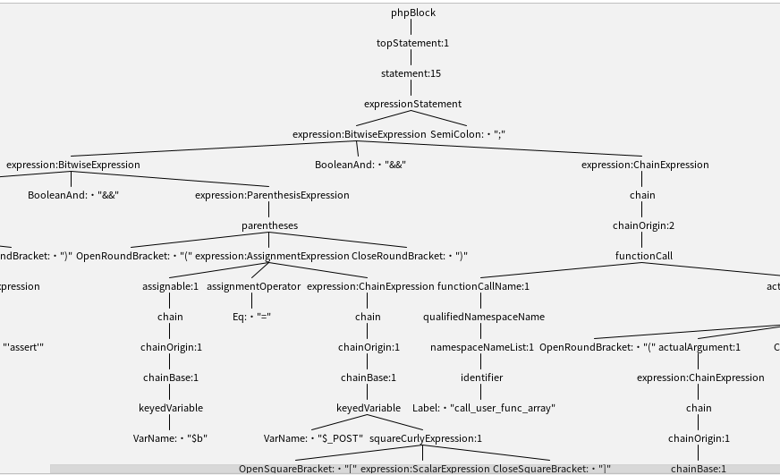
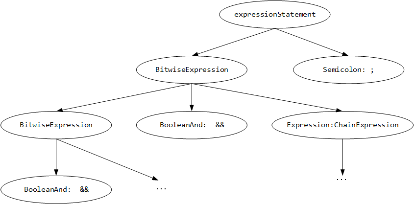

# MSDetector
Code for TASE 2022 paper- MSDetector: A Static Php Webshell Detection System based on Deep-Learning


The developing environment

- PreProcessModule: 
  * jdk 11
  * maven 3.6.2
  * IDEA

- DeepLearningModule:
  * python 3.7
  * pytorch 1.7.1
  * scikit-learn 0.24.1
  * transformers 4.0.1
  * pycharm


There is another project which use CodeBert to detect webshell: [CodeBERT-based-webshell-detection](https://github.com/lyccol/CodeBERT-based-webshell-detection)

We provide some testcases in dictionary phpProcessor/src/test/files.

# Datasets

## Pretrain datasets

we utilize [Code Search Net](https://github.com/github/CodeSearchNet) dataset, the source datas are jsonl files, we utilize [CSN_process.py](https://github.com/for-just-we/MSDetector/blob/master/CSN_process.py) to parse jsonl files into PHP files.

## Webshell datasets

We first download datas from sources below:

|  Type   | Url  |
|  ----  | ----  |
| Webshell  | https://github.com/tanjiti/WebshellSample |
| Webshell  | https://github.com/JohnTroony/PHP-Webshell |
| Webshell  | https://github.com/learnstartup/4tweb |
| Normal  | https://github.com/johnshen/PHPcms |
| Normal  | https://github.com/WordPress |
| Normal  | https://github.com/phpmyadmin/phpmyadmin |
| Normal  | https://github.com/smarty-php/smarty |
| Normal  | https://github.com/yiisoft/yii |

Then we perform data clean and data augment manually, we spent 2 months to process the dataset in following steps:

- First of all, there are a large number of big files in the dataset, some of which even reach more than 2000 lines of code. This kind of huge code first goes beyond the processing scope of the deep learning model. Secondly, it is rarely appears in the real-world scene. In the real-world web penetration, the webshell used by the attacker is almost a pony, and the big files are usually very easy to be intercepted by the firewall.Therefore, for big files in the dataset, we first splits them. big files in the dataset usually contain many HTML tags, of which only the content in PHP tags is related to webshell, while big files usually contain multiple PHP tags. Therefore, we first eliminate the redundant HTML tags in the big code and only keep the PHP tags. Then, we manually divides the script containing multiple PHP tags into multiple scripts, and each script contains only one PHP tag. At the same time, the normal samples collected in this paper are downloaded from the open source PHP project. The PHP files in the normal samples usually contain multiple functions, and each function contains a large piece of code. Here we manually split these PHP files. After splitting, each script contains only 1 to 2 functions.


- After previous step, we cut the large samples into small samples, but the text feature distribution of the data set is very uneven, which is easy to cause data bias. Dangerous functions such as encryption confusion functions, callback functions and reflection functions are usually called in webshell code. These functions hardly exist in the normal samples collected in this paper, but in fact, these functions are also applied in other normal scenarios. The model trained on such datasets is likely to have some bias against this kind of function calls, For example, when such function calls appear in the code segment, the model will automatically determine that the code segment belongs to webshell. In order to alleviate this bias, we downloaded some source codes calling such functions from GitHub according to the name of each function in following table, and added them to our white sample data set as white samples. We also manually inject some malicious code into this normal samples as webshell, which is Testset-2 in the paper.


|  function type   | function name  |
|  ----  | ----  |
| encrypt and decrypt function | md5, crypt, sha1, urlencode, urldecode, base64_encode, base64_decode, str_rot13 |
| string operation | chr, preg_replace, stripcslashes, addslashes, convert_uudecode, convert_uuencode, str_replace |
| reflection | ReflectionClass,  ReflectFunction,  ReflectionMethod |
| callback | call_user_func_array, call_user_func, array_filter, array_map, array_walk, usort |
| compress and decompress | gzcompress, gzdeflate, gzencode, bzcompress |


- After the previous preprocessing work, we apply some data agument operations to the dataset to expand the number of samples in the dataset. First, in PHP, there are many global variable names and function names with similar semantics. These variable names and function names can be replaced equivalently. For example, global variable name `$_Get`,`$_Post` and `$_Request` has same meaning when getting input messages. These global variables receive parameters from user requests. They have similar semantics and can be replaced equivalently. Similarly, `echo` and `print` are used to output information, so some equivalent substitutions can be made in the code. Then `gzdeflate`, `gzcompress` and `gzencode` are string compression functions. Different compression algorithms are used, but the use scenarios are similar. And `Base64_ encode`，`str_ Rot13` are encryption functions, which can also be replaced equivalently. Here, we write a tool to automatically select some samples randomly for data enhancement. This tool is simply implemented with regular expression. The principle of the automatic tool is roughly as follows. The tool itself contains a variable and function table that can be equivalent replaced. After giving the code that needs to be enhanced, the tool will detect how many positions in the input code fragment can be equivalent replaced. If there is no position for equivalent replacement, skip, if there is, Then, `m` positions are randomly selected from these positions for equivalent replacement. `m` is a random number greater than or equal to 1 and less than or equal to the number of replaceable positions. The variable name for replacement selection of these positions is also random.

- After we apply the data augment operations, there may be scripts with the same content in the dataset. These repeated data items may make the detection effect of the detection system in this paper unreasonably high, so we need to carry out the de duplication operation, which cannot be distinguished by the file name alone. Therefore, we carry out the MD5 encryption operation on each PHP script, and find the scripts with the same content through the MD5 value, so as to carry out the file de-duplication. After the de-duplication operation, we divided our dataset into two parts: training set and test set. The training set contains 3280 webshell black samples and 3226 normal white samples, and the test set contains 930 webshell black samples and 987 normal white samples. This testset is Testset-1 in the paper.


Unfortunately our dataset has been used in another project with another institute(our first party, also the charger of that project), they require us not to open-source datasets.


# MSDetector

## PreProcessModule

The PreProcessModule is implemented in Java, the main class is `Main`, and the class to parse PHP file is `generator/ScriptParser`. We utilized Java Antlr API, at first we intend to implement the module in python, but it seems that there are some bugs in python-antlr API for PHP. 

The PreProcess run in following steps:

- Simplify and compress original ANTLR AST for PHP file

- Traverse AST to generate token sequence, string sequence and node tag sequence.

The output of PreProcessModule for a given PHP file is a json string, which is like:

```json
{
    "tokenSequence": [xxx, xxx, ...],
    "stringSequence": [xxx,...],
    "tags": [xxx, xxx, ...]
}
```

The json string could be easily parsed by python json api which is useful for next step.

### Simplify AST

The Antlr AST is complex and large, we mainly consider 

- Symbolizing VarName, FunctionName and ClassName in PHP file

- Extracting string literals from PHP file

So, we do not need to parse the complex Antlr AST, the first step of PreProcessModule is to simplify AST, which contains two steps:

- We first convert the Antlr AST to our self-defined class `SimpleNode`, which is done by [ConversionUtil.ConversionUtil](https://github.com/for-just-we/MSDetector/blob/master/phpProcessor/src/main/java/util/ConversionUtil.java) 

- The next step is to compress AST, the two images below gives an example, the purpose of compressing is to eliminate nodes in AST which contain only one child, after simplifing, it would be easier for us to traverse.






### Traverse AST

Traversing AST is done by [ScriptParser.parseSimpleTree](https://github.com/for-just-we/MSDetector/blob/master/phpProcessor/src/main/java/generator/ScriptParser.java#L76), we use IDEA Antlr plugin to visualise origin Antlr AST to debug our programs.

During traversing AST, we focus on the nodes containing variable names, function names and class names and constants(`int`, `float`, `string`, `bool`).

- variable name: this is the most easy case, if the AST node type is `VarName`, then this is a variable name, in our program, if a var name not in global variable table(`$_GET`, `$_POST`, etc, `$this`), then the variable name would be symbolized.

- function names: it is complex than variable names, the function name appears in following cases:
   * function declaration(`FunctionDecl`) and class inner class declaration(`classStatement`).
   * function calls: direct function call(`funcCall`), class static inner function call, object member function call, and call by variable name.

- class names: class declaration(we treat class, trait and interface as class) and new expression, class static inner function call.

Those rules may not be complete but sufficient to our task. It is worth noting that we generate token sequence, string literals and tag sequence at the same time, regardless of pretrain stage and train stage.

### String parser

when encounting string literals, we implement a string parser to determine the type of the string literal, which is [StringParser](https://github.com/for-just-we/MSDetector/blob/master/phpProcessor/src/main/java/util/StringParser.java). The rationale is key words matching, which could introduce errors some times but in most cases correct, we utilize entropy algorithm to determine whether that is a encrypted string, but it works well on long encrypted string but is inefficient in short encrypted string, we still define some keywords to detect encrypted string.

It would be more efficient to implement string parser by machine learning, but the key issue is that it consume many time to label a string dataset.


## DeepLearningModule

Our method utilize [CodeBert](https://github.com/microsoft/CodeBERT) model, we simply add a linear lay on top of CodeBert to classify vectorized PHP file.

The model are defined in [model.py](https://github.com/for-just-we/MSDetector/blob/master/model.py).

- When pretraining, we use `BERT_POS` class, and save all parameters to a pkl file after pretraining.

- When training and detecting, we use `BERTClassifier` class, in training stage, we first load pretrained parameters and load that belong to CodeBert model to `BERTClassifier` model.


During pretraining(and training, detecting stages), a token in token sequence may be tokenized into several subtokens, so in pretraining stage, the corresponding tag should be expanded too. We use BIO mode, for example:

- if token `t1`(tag `n1`) is tokenized to `[t11, t12, t13]`, then its tag would be expanded to `B-n1, B-n2, B-n3`.

- if token `t1` remains unchanged after tokenization, its tag would still be expanded to `B-n1`.
